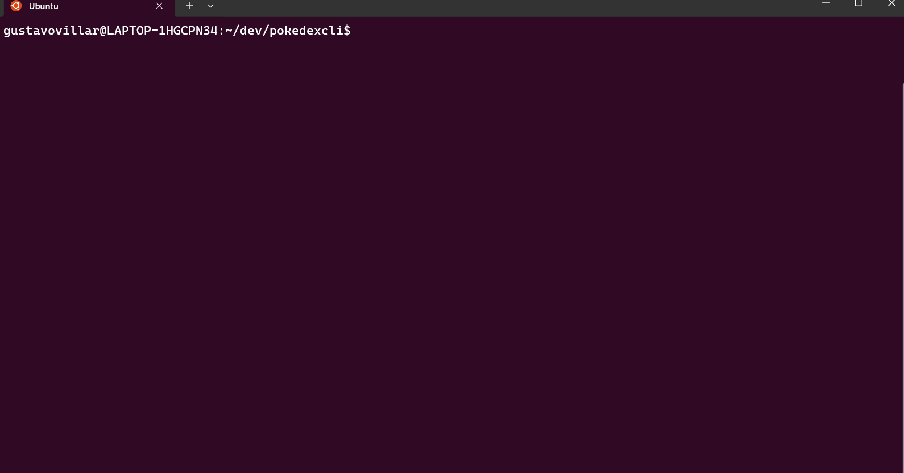

# Pokedex CLI

[](https://github.com/Gustavo-Villar/pokedexcli/actions/workflows/go.yml)

The Pokedex CLI is a command-line interface application that allows users to explore the Pokemon universe through the PokeAPI. It provides functionalities such as listing Pokemon in various locations, catching Pokemon, and displaying details of caught Pokemon.

## Features

- **Explore Location Areas**: List Pokemon in different location areas.
- **Catch Pokemon**: Attempt to catch Pokemon to add to your Pokedex.
- **View Pokedex**: Display your caught Pokemon and their details.
- **Navigation**: Navigate through different location areas.
- **Help**: Get command help directly in the CLI.

## Getting Started

### Prerequisites

- Go 1.20 or higher.

### Installation

Clone the repository to your local machine:

```bash
git clone https://github.com/yourusername/pokedexcli.git
cd pokedexcli
```

Build the application
```bash
go build .
```

### Running the Application
To start the Pokedex CLI, simply run the built executable:
```bash
./pokedexcli
```

### Running the Tests
To run the automated tests for this project, use the following command:
```bash
go test ./...
```

## Usage
Upon starting the application, you will be presented with a command prompt:
```bash
>_: 
```

Type help to see a list of available commands:
```bash
>_: help
```

Type map to see a list of avaiable areas:
```bash
>_: map
```
To explore a location area, use the explore command followed by the area name:
```bash
>_: explore pallet-town
```

To catch a Pokemon, use the catch command followed by the Pokemon name:
```bash
>_: catch pikachu
```

View your caught Pokemon with the pokedex command:
```bash
>_: pokedex
```

Exit the application with the exit command:
```bash
>_: exit
```
### Video Example of Usage



## Acknowledgments

-[PokeApi](https://pokeapi.co/) for providing the data used by this application.
